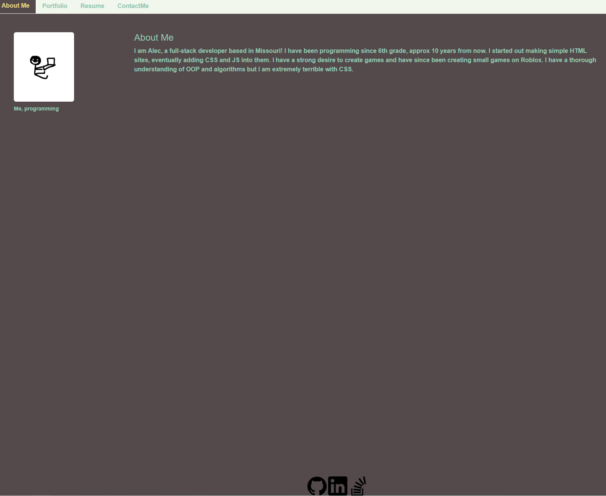

### Table of Contents 

[Description](#Description)

[Install instructions](#Install-instructions)

[Usage](#Use-instructions)

[Credits](#Credits)

[License](#License)

[How to contribute](#How-to-contribute)
# Alec's Portfolio in React

## Description

This is a portfolio created by me, Alec, to show off my skills with my previous projects. It is created with React

## Install instructions

To run locally on your machine, simple download and install all libraries with npm i followed by npm start

## Use instructions

Click on the nav links to view the different pages and accomplishments

## Credits 

N/A

## License 

This project uses the MIT license

[License file](LICENSE.txt)
## How to contribute

N/A

## Link to deployment

[Live site](https://alecruin.github.io/personal-website-REACT/)

## Image of deployment

